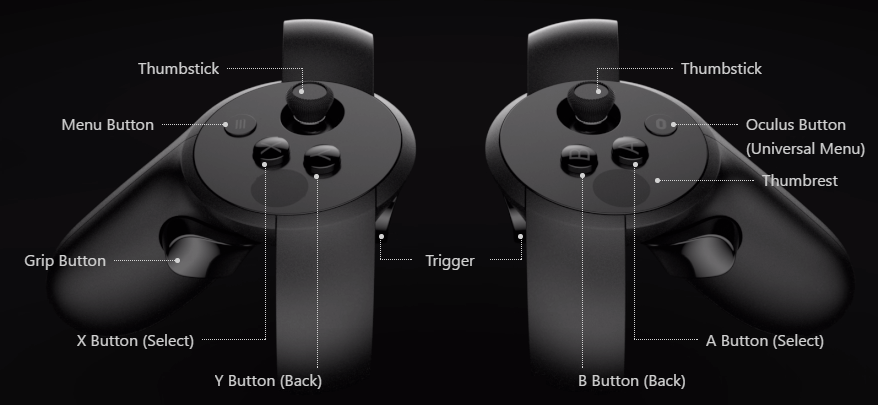

# NeuroCave

NeuroCave is a web-based tool that enables researchers to visualize connectome data in order to more effectively observe 
how the regions of the brain are interconnected. NeuroCave helps researchers to explore and analyze the intrinsic geometry 
of the brain by letting the user switch quickly between different topological spaces where the connectome is embedded. 
Our tool supports multiple, side-by-side viewing of one or more connectomes, facilitating group study analysis. With a 
simple and easy-to-use interface, users can explore all the connections with a edge-on-demand technique and to focus on 
very specific areas by toggling on and off regions of the brain as desired. Simple analytics such as nodal strength 
and shortest path trees can be computed on the fly. Our tool support explorations using VR techniques, and it is
compatible with the Oculus Rift headset and the Oculus Touch input accessory for nodal
selection. 

# Network Neuroscience article and video documentation

An article introducing NeuroCave— "NeuroCave: A Web-based Immersive Visualization Platform for Exploring Connectome Datasets"— has been acccepted to Network Neuroscience, available [here](https://doi.org/10.1162/NETN_a_00044). A short video presentation introducing the main features of NeuroCave can be found 
[here](https://dl.dropboxusercontent.com/u/571874/NeuroCave_VIS_2017.mp4).

# How to use NeuroCave

The NeuroCave software is accessible [online](https://creativecodinglab.github.io/NeuroCave/). There is no need of 
installation since it is a web-based application. Users can upload and visualize their own data by pointed to a folder 
containing the data. The folder should contain 3 types of files:
- Network files: a ".csv" file per subject containing the adjacency matrix of the connectome.
- Topology files: a ".csv" file per subject containing the different topological and clustering information for each 
  region. Topological information are expected to be an (x,y,z) vector for each label. Clustering information are 
  expected to be an integer number starting with 1. The clustering information column name should have the keyword
  "Clustering", i.e. "XYZ-Clustering".
- Configuration file: a "index.txt" file that lists the available network and topology pair files and associates them 
  to the subject ID.

Please contact Johnson Keiriz at jgadel2@uic.edu or Angus Forbes at angus@ucsc.edu (or create an issue on this GitHub repo) if you have any questions. 

# Creating an Atlas for NeuroCave

The Atlas is a look-up-table csv file containing labels information about a specific segmentation regime. There exist
many famous Atlases for human brains such the Desikan-Killiany which is the default Atlas used in Freesurfer. Generally, 
Freesurfer comes with 4 [Atlases](https://surfer.nmr.mgh.harvard.edu/fswiki/CorticalParcellation): 

  - 'Desikan-Killiany' cortical atlas (default)
  - 'Destrieux' cortical atlas
  -	'DKTatlas40' atlas
  -	'Brodmann Areas' atlas
  
Other Atlases can be found [here](http://www.lead-dbs.org/?page_id=1004). Most Atlases consist of less than 100 
bi-hemispheric brain regions, a recent Atlas: the HCP MMP (2016) consists of 180 areas per hemisphere. Higher 
resolution Atlases can be self-made. The Atlas filename starts with the name prefix "LookupTable_", so for example:
the freesurfer Atlas filename is: "LookupTable_freesurfer.csv". The Atlas file contains a header with 4 essential 
columns: label, Anatomy, region_name and hemisphere.
 
 - The label is an integer number.
 - The Anatomy is the lobar affiliation: Frontal, Parietal, Temporal, Occipital and Subcortical with left or right prefix.
 - The region_name is the region name.
 - the hemisphere can be left or right

Other columns can be added and used as an additional color coding scheme such as "Rich Club" or "Embeddness". The data
are semi-column separated. The user can create his/her own Atlas following the above rules. The Atlases must be listed 
in the "index.txt" file located in the data folder in order to be discovered.  

# VR instructions

NeuroCave is fully compatible with the [Oculus Rift](https://www.oculus.com/). The application requires both the Oculus 
Rift and Oculus Touch for navigation and control. Currently, Firefox Nightly and Chromium are supported. Please check 
the [WebVR](https://webvr.rocks/) website for browsers that support the required hardware. Support to Gear VR will be 
added later.
- In order to enter VR mode, the user presses the letter 'v'. 
- The user then must choose which side to navigate: 's' for the left side and 'd' for the right side.
- The letter 'e' is used to exit VR mode.
- In VR mode, the user can use the thumbstick axes to zoom, pan and rotate. Pressing the grip button will speed up the
  navigation.
- In VR mode, the user can points to a node using the trigger button. In order to select a node, the user needs to press
  the grip button while pressing the trigger button.

# Node coloring

NeuroCave allows different color coding schemas, such as:
- Anatomy - Nodes are grouped according to their neuroanatomical locations;
- Embeddedness - Nodes that have been shown to be highly embedded in the human structural connectome are 
  highlighted;
- Rich-club - Rich-club nodes as defined by van den Heuval et al. are highlighted. Note that the Rich-club regions 
  form a subset of highly-embedded nodes;
- Custom-defined - Users can create their own atlases.

# Edge bundling and edge coloring

As a primary component of connectome datasets is the connections between nodes representing brain regions, \textit{NeuroCave} introduces a range of features to visualize edges efficiently and effectively. Network visualizations that have an excessive amount of overlapping edges, common in dense node-link diagrams, can introduce unwanted visual clutter, which makes it more difficult to read and interpret the network. We provide different ways to mitigate this problem. First, we provide the option to hide all edges by default (i.e., to show only the nodes), and then enable a user interactively add edges as desired. In this mode, a user can select any node as a "root" node, causing all connected edges stemming from this node to be displayed. Second, to minimize the clutter occurring from edge crossings, even when all edges are displayed, we use the force directed edge bundling (FDEB) algorithm to group edges going in the same direction. FDEB creates these bundles through an iterative algorithm that consists of a series of subdivision cycles. In each cycle, we subdivide an edge into a specified number of points (by default, we use 6 cycles, and we double the number of points each cycle, ending up with 64 subdivision points plus the two original points of the edge). After the subdivision, we iteratively move each subdivision point in an update step to a new position determined by modeling the forces among the points. 

Standard implementations of edge bundling are too slow for the large numbers of edges that can appear in some connectome datasets, reducing the frame-rate of the application and preventing an effective real-time experience. Therefore, we introduce an enhanced WebGL texture-based implementation, extending previous work by Wu et al. Since the division and update operations are performed on each point independently, the FDEB algorithm is parallelizable and can be optimized for the GPU. The texture-based method stores the subdivision points in a 2D GPU texture, where each row represents the 3D coordinates of points belonging to the same edge. Since write operations are generally unavailable to GPU textures in most WebGL implementations, a ping-pong algorithm is used to first render results to an offscreen framebuffer object. Two shaders are utilized: the first performs the subdivision operation, and the second executes the update steps. GPU textures possess a limitation on their sizes. Hence, a large number of edges can not be fit in one texture. In Wu et al.'s implementation, this limitation on the texture size limits is not addressed. We enhanced the algorithm using a tiling approach in which we can extend the maximum number of edges by using multiple textures. Since the total number of points of each edge after all cycles will be known ahead (64 subdivision + 2 end points), we tile the edges when the maximum number of possible rows per texture is achieved. Our texture-based implementation can bundle the closest 1000 edges to the selected node at interactive rates on a desktop computer. While this is sufficient for the datasets we explored, we also enable users to choose threshold values that limit only connections above or below specified strengths to be computed, both to improve performance in situations where the data contains very dense interconnections, and to assist in analyses focused on particular connectivity weights. 

Each edge can be colored using a gradient, whose two colors are chosen according to the colors of the source and target nodes that it connects. The gradient is skewed towards the node possessing the higher nodal strength, that is, the sum of weights of links connected to the node. This enables the user to quickly recognize the strength of the selected node with respect to its interconnected neighbors, which can help in identifying important nodes or clusters of nodes, as well as to highlight the reason for modular changes when they occur in group studies. 

# Testing

NeuroCave is available [here](https://creativecodinglab.github.io/NeuroCave/) for online testing. An article introducing 
NeuroCave is acccepted to Network Neuroscience, available [here](https://doi.org/10.1162/NETN_a_00044).

# NeuroCave Project members

- Johnson Keiriz, Olu Ajilore, and Alex D. Leow (University of Illinois at Chicago); 

- Liang Zhan (University of Wisconsin-Stout); 

- Angus Forbes (University of California, Santa Cruz). 

Software development was led by Johnson Keiriz, extending the prior work of Conte et al.'s BRAINtrinsic tool. Johnson Keirez is a member 
of the [Creative Coding Lab](https://creativecoding.soe.ucsc.edu), directed by Angus Forbes. This research is a collaboration with Alex Leow and Olusola Ajilore in the UIC Department of Psychiatry. NeuroCave has been used to support researchers at [CoNECt@UIC](http://conect.brain.uic.edu), 
an interdisciplinary team of researchers and clinicians devoted to improving the understanding of brain connectivity.

# References

- Conte, G., Ye, A.Q., Forbes, A.G., Ajilore, O.A., and Leow, A.D. (2015). BRAINtrinsic: A virtual reality-compatible tool for exploring intrinsic topologies of the human brain connectome. In Y. Guo, K. Friston, A. Faisal, S. Hill, and H. Peng, editors, Brain Informatics and Health, volume 9250 of Lecture Notes in Artificial Intelligence, chapter 7, pages 67–76. Springer.

- Holten, D., & Van Wijk, J.J. (2009). Force-directed edge bundling for graph visualization. In Proceedings of the Eurographics Conference on Visualization (EuroVis) (pp. 983–998).

- van den Heuvel, M.P. and Sporns, O. (2011). Rich-club organization of the human connectome. The Journal of Neuroscience, 31(44): 15775-15786.

- Wu, J., Yu, L., & Yu, H. (2015). Texture-based edge bundling: A web-based approach for interactively visualizing large graphs. In Proceedings of the IEEE Conference on Big Data (pp. 2501–2508).

- Ye, A.Q., Ajilore, O.A., Conte, G., GadElkarim, J., Thomas-Ramos, G., Zhan, L., Yang, S., Kumar, A., Magin, R.L., Forbes, A.G., and Leow, A.D. (2015). The intrinsic geometry of the human brain connectome. Brain informatics, 2(4): 197-210.

- Ye, A.Q., Zhan, L., Conrin, S., GadElKarim, J., Zhang, A., Yang, S., Feusner, J.D., Kumar, A., Ajilore, O.A., and Leow, A.D. (2015). Measuring embeddedness: Hierarchical scale‐dependent information exchange efficiency of the human brain connectome. Human Brain Mapping, 36(9): 3653-3665.

- Zhan, L.,  Jenkins L.M., Wolfson, O.E., GadElkarim, J.J., Nocito, K., Thompson, P.M., Ajilore, O., Chung, M.K., Leow, A.D. (2017). The significance of negative correlations in brain connectivity. Journal of Comparative Neurology, 525(15): 3251–3265.

