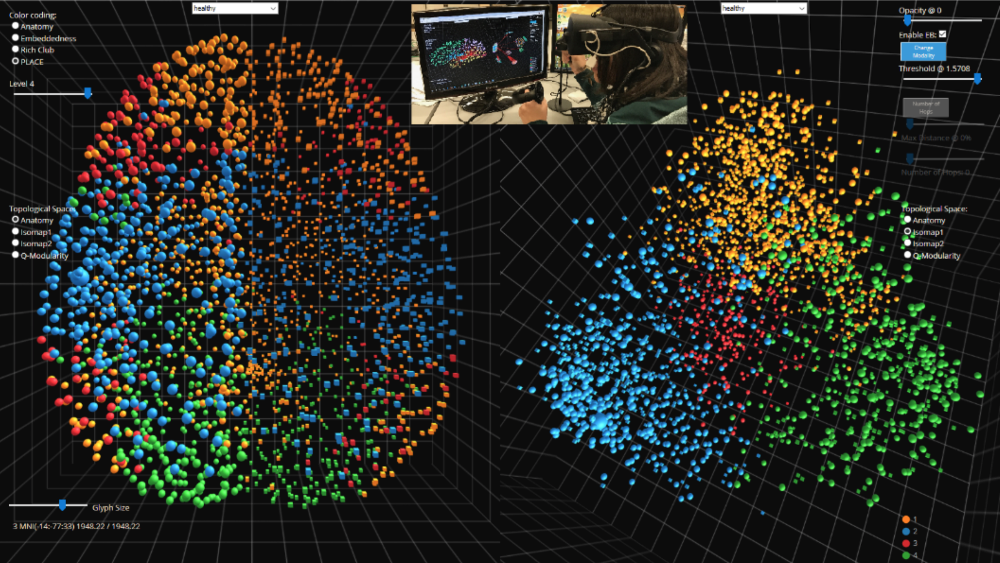
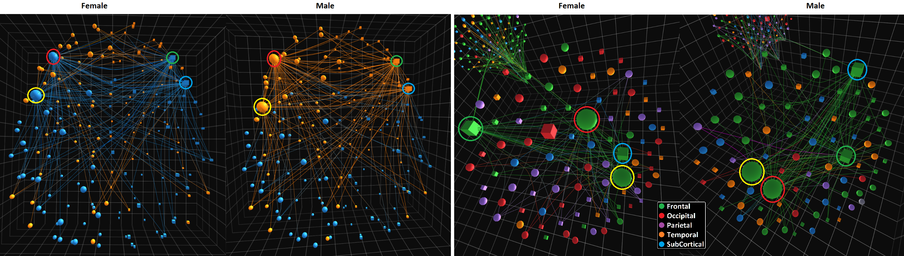
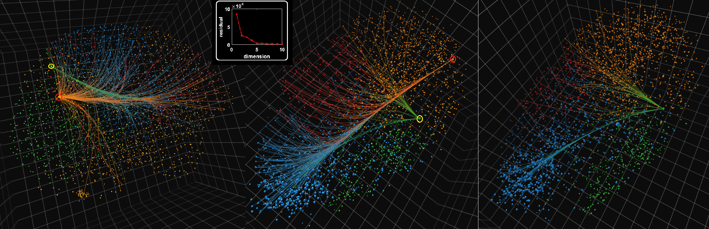

# NeuroCave

NeuroCave is a web-based tool allows to visualize connectome data that describes how the regions of the brain are interconnected. NeuroCave enables researchers to explore and analyze the intrinsic geometry of the brain by letting the user switch quickly between different topological spaces where the connectome is embedded. It supports multiple, side-by-side viewing of one or more connectomes, facilitating group study analysis. With a simple and easy-to-use interface, users can explore all the connections with a edge-on-demand technique and 
focus on very specific area by switching on and off regions of the brain. Simple analytics such as nodal strength 
and shortest path trees can be computed on the fly. This tool has been developed to support explorations using VR techniques, and it is
compatible with the Oculus Rift headset and the Oculus Touch input accessory for nodal
selection. A presentation for NeuroCave can be found [here](https://dl.dropboxusercontent.com/u/571874/NeuroCave_VIS_2017.mp4).

# How to use it

NeuroCave is accessible [here](https://github.com/CreativeCodingLab/NeuroCave/). There is no need of 
installation since it is a web-based application. Users can upload and visualize their own data by pointed to a folder containing the data. The folder should contain 3 types of files:
- Network files: a ".csv" file per subject containing the adjacency matrix of the connectome.
- Topology files: a ".csv" file per subject containing the different topological and clustering information for each 
region. Topological information are expected to be an (x,y,z) vector for each label. Clustering information are 
expected to be an integer number starting with 1.
- Configuration file: a "index.txt" file that lists the available network and topology pair files and associates them to the subject ID.

# VR instructions

NeuroCave is fully compatible with the [Oculus Rift](https://www.oculus.com/).

# Color coding

NeuroCave allows different color coding schemas, such as:
- Anatomy - Nodes are grouped according to their neuroanatomical locations;
- Embeddedness - Nodes that have been shown to be highly embedded in the human structural connectome [1] are 
highlighted;
- Rich-club - Rich-club nodes as defined by van den Heuval et al. [2] are highlighted. Note that the Rich-club regions form a subset of highly-embedded nodes;
- Custom-defined - Users can create their own atlases.

# Testing

NeuroCave is available [here](https://creativecodinglab.github.io/NeuroCave/) for online testing.

# Acknowledgment

NeuroCave Project members: 

Johnson Keiriz, Angus Forbes, Morris Chukhman, Olu Ajilore, and Alex D. Leow (University of Illinois at Chicago); Liang Zhan (University of Wisconsin-Stout). 

The software development of NeuroCave was lead by Johnson Keiriz, based on Conte et al.'s BRAINtrinsic tool [3,4]. Dr. Keirez is a member of the [Creative Coding Research Group](https://www.evl.uic.edu/creativecoding/), directed by Dr.
Angus Forbes. The research group is part of the [Electronic Visualization Lab](https://www.evl.uic.edu) (EVL) at University of Illinois at Chicago (UIC).
This research is a collaboration with Dr. Alex Leow, Dr. Olusola Ajilore, and Dr. Allen Ye, all belonging 
to UIC Department of Psychiatry. NeuroCave has been used to support researchers at [CoNECt@UIC](http://conect.brain.uic.edu), an interdisciplinary team of researchers and clinicians devoted to improving
the understanding of brain connectivity.

# References

**[1]** - Ye, A. Q., Zhan, L., Conrin, S., GadElKarim, J., Zhang, A., Yang, S., Feusner, J.D., Kumar, A., Ajilore, 
O. and Leow, A. D. (2015). Measuring embeddedness: Hierarchical scale‐dependent information exchange efficiency of the human brain connectome. Human Brain Mapping, 36(9): 3653-3665.

**[2]** - van den Heuvel, M. P., & Sporns, O. (2011). Rich-club organization of the human connectome. The Journal of Neuroscience, 31(44): 15775-15786.

**[3]** - Conte, G., Ye, A. Q., Forbes, A. G., Ajilore, O., and Leow, A. D. (2015). BRAINtrinsic: A virtual reality-compatible tool for exploring intrinsic topologies of the human brain connectome. In Y. Guo, K. Friston, A. Faisal, S. Hill, and H. Peng, editors, Brain Informatics and Health, volume 9250 of Lecture Notes in Artificial Intelligence, chapter 7, pages 67–76. Springer.

**[4]** - Allen, Q. Y., Ajilore, O. A., Conte, G., GadElkarim, J., Thomas-Ramos, G., Zhan, L., Yang, S., Kumar, A., Magin, R.L., Forbes, A.G. and Leow, A.D. (2015). The intrinsic geometry of the human brain connectome. Brain informatics, 2(4), 197-210.

